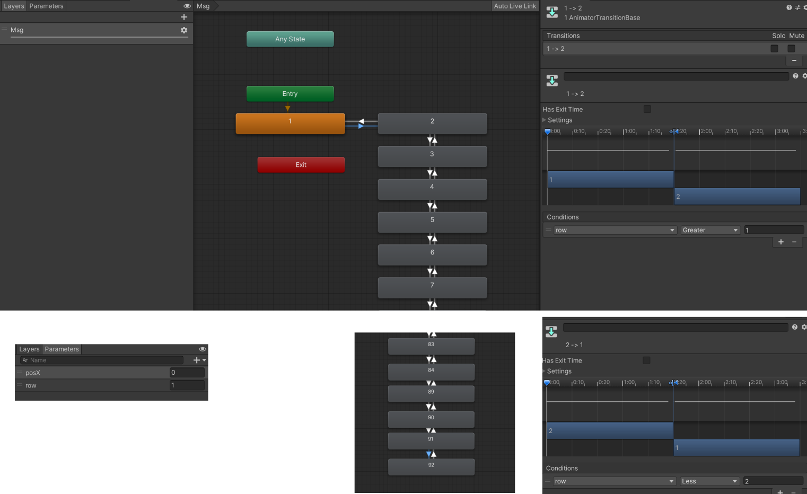

# remote

アバター側で使用するマテリアルとアニメーションファイルです。

マテリアルには `ISO-2022-JP` (JISコード)の2バイト部+余白を画像化したものをセットしてください。[こちらの Excel 方眼紙](https://docs.google.com/spreadsheets/d/1xgI0ddt1uvRfUDf8UB0wWZbASHmDxSwz/edit?usp=sharing&ouid=110333030137213091974&rtpof=true&sd=true)を Windows 版 Excel で開くと簡単に作成することができます。

また、FXレイヤのアニメーターを以下のように設定してください。

